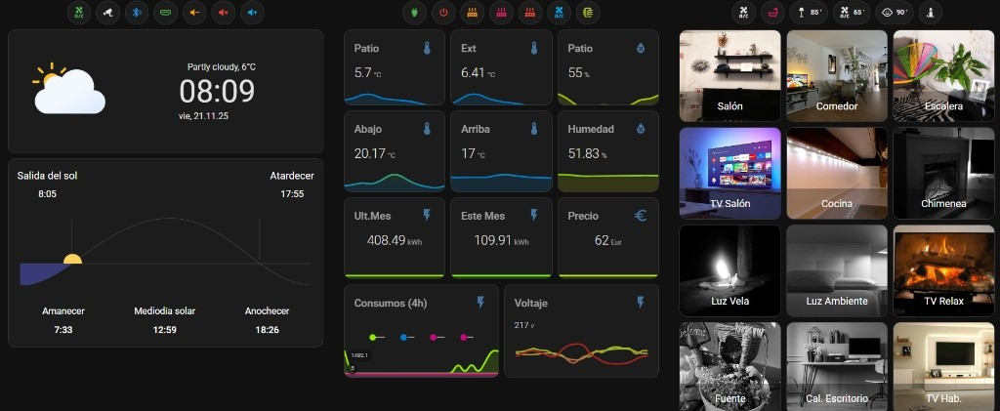
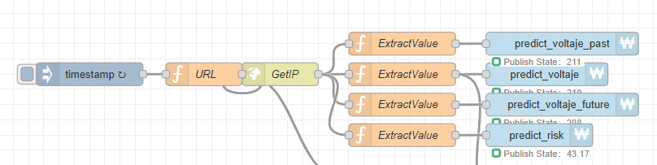
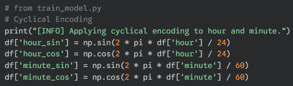
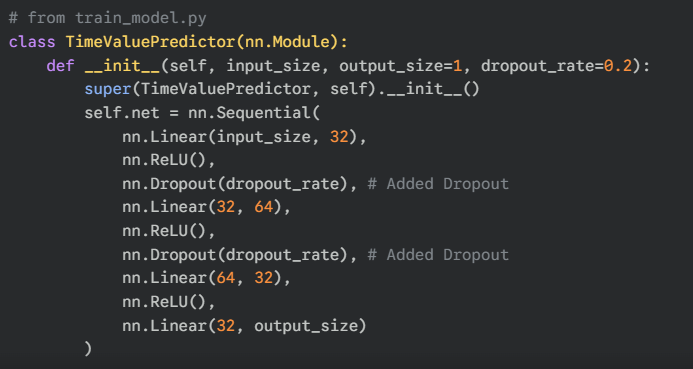
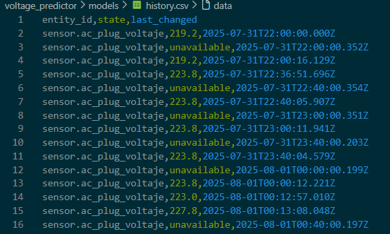
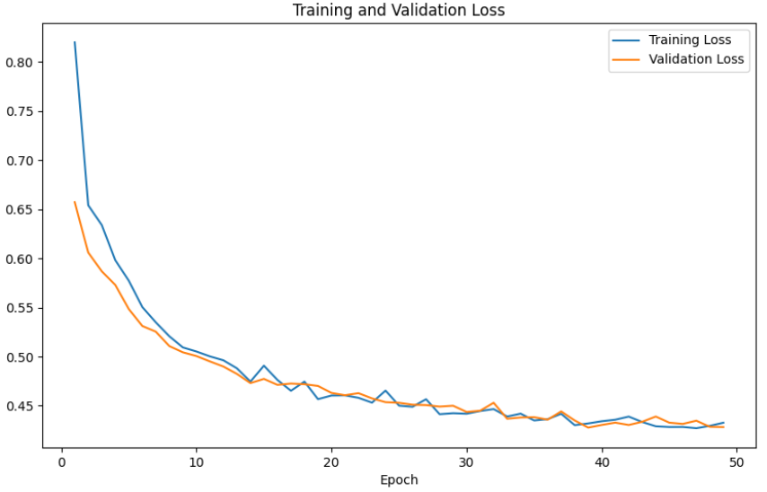
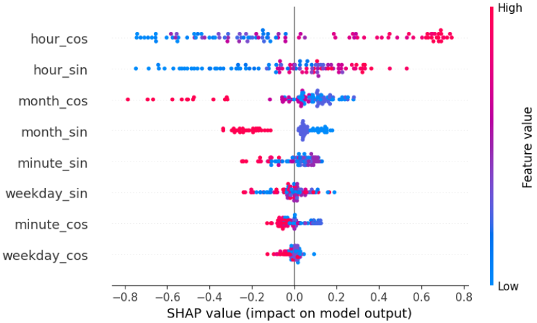
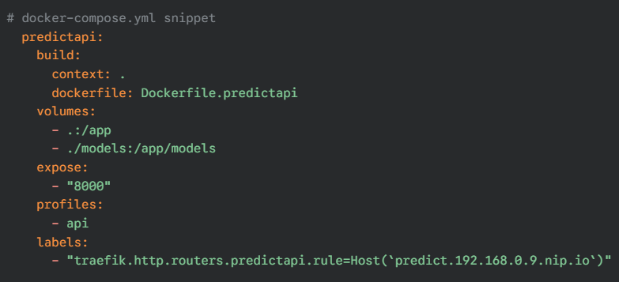
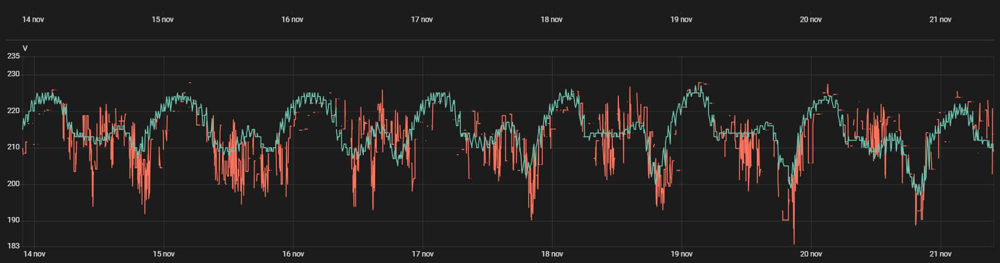
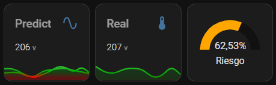

# Vibe Coding My Smart Home: Predicting Voltage Drops with GenAI, PyTorch, and Home Assistant

**Carlos Méndez Pérez**
Innovation Technology Manager
**November 2025**

Living in a small village has its charms, but grid stability isn’t one of them. I’ve struggled for years with spontaneous voltage drops. Home Assistant helps by monitoring these events, but that’s reactive — I wanted to anticipate issues before they happened.

So I built a predictive system using PyTorch, FastAPI, Docker, and a “vibe coding” workflow powered by GitHub Copilot. The result: a model that forecasts voltage dips and triggers automations to protect my home’s electrical system.

---

## 1. The Control Center: Home Assistant

Everything starts with Home Assistant. It aggregates data from all my sensors and acts as the central interface for the entire home.

### My Dashboard



While this dashboard provides great real-time visibility, I needed historical data to train a model capable of predicting future voltage behavior.

---

## 2. The Data Pipeline: Node-Red Integration

To connect Home Assistant with my AI backend, I used Node-Red. It sends the current timestamp to my prediction API and writes the output into MQTT sensors that Home Assistant reads.



The flow extracts four key metrics:

* **predict_voltaje** — Prediction for the current timestamp
* **predict_voltaje_past** — Voltage 60 minutes ago
* **predict_voltaje_future** — Prediction 60 minutes ahead
* **predict_risk** — Probability (0–100%) of an anomaly

These are displayed directly in my Home Assistant dashboard.

---

## 3. Vibe Coding with GenAI

Building a full ML stack is time-consuming. This is where GenAI truly helped.

Instead of manually writing boilerplate, I focused on high-level design and used GitHub Copilot for rapid iteration. Prompts like:

```text
# create a pytorch neural network with 3 layers and dropout  
# apply cyclical encoding to hour and minute columns  
```

allowed me to move faster and concentrate on architecture and logic rather than syntax.

---

## 4. The Model: PyTorch & Cyclical Encoding

The system uses a feed-forward neural network implemented in PyTorch. But before training, the dataset needed proper feature engineering.

### Feature Engineering: Cyclical Encoding

Since hour “23” and “0” are next to each other in time but far numerically, I use sine/cosine transformations to encode temporal features.



### Model Architecture

The neural network includes several dense layers with `nn.Dropout` to reduce overfitting.



---

## 5. Training and Explainability

Training was performed on historical data (`history.csv`) using early stopping to maintain the best weights.



The training and validation curves show a healthy convergence without overfitting:



### Key Observations

* **Fast convergence** around epochs 35–40
* **No overfitting**, with training and validation loss closely aligned
* **Diminishing returns** past 50 epochs

### SHAP Explainability

To understand *why* the model predicts voltage drops, I applied SHAP analysis.



#### What the Model Learned

**Daily Cycle (hour_cos, hour_sin)**

* Voltage rises at night (lower load)
* Voltage drops at midday (higher load)

**Seasonal Pattern (month_cos)**

* Winter shows lower voltage due to increased heating and lighting
* Summer maintains higher voltage, partly due to solar compensation and lower lighting demand

**Minor Variables (weekday, minute)**

* Minimal impact compared to hour and seasonality

The model effectively learned real-world electrical behavior.

---

## 6. Deployment: Docker & Trend Logic

The system runs via Docker Compose, with separate services for:

* Model training
* SHAP explainability
* API prediction service



### Trend Adjustment Logic

To smooth noisy predictions, the API computes an adjustment based on past and future values:

```python
def adjust_prediction_with_trend(current, past, future):
    values = np.array([past.value, current.value, future.value])
    std_dev = np.std(values)
    trend = future.value - past.value
    
    trend_factor = 0.5
    adjustment = (trend / 2) * (std_dev / np.abs(trend)) * trend_factor if trend != 0 else 0

    return TimeValuePrediction(..., value=current.value + adjustment)
```

---

## 7. Results

The system is fully operational. Below, the red line is the real voltage and the cyan line shows the model’s prediction:



When a voltage dip is predicted and the risk is high:

* Home Assistant triggers an alert
* I receive a Telegram notification
* Automations disconnect non-essential heavy loads (e.g., the water heater)




---

## Resources

You can find the full source code, including Docker configs and training scripts, on GitHub:

👉 **[https://github.com/cinderl/voltage_predictor](https://github.com/cinderl/voltage_predictor)**

